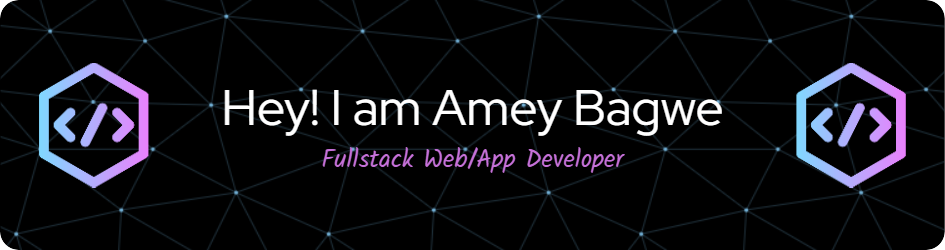

<h1 align="center">Hi 👋, I'm Amey Bagwe</h1>
<h3 align="center">A passionate Web/App Developer from India</h3>

  

- 📫 How to reach me **ameybagwe09@gmail.com**

<h3 align="left">Connect with me:</h3>

<h3 align="left">Languages and Tools:</h3>

                  

# 📊 GitHub Stats:
 
 

<!-- Proudly created with GPRM ( https://gprm.itsvg.in ) -->
